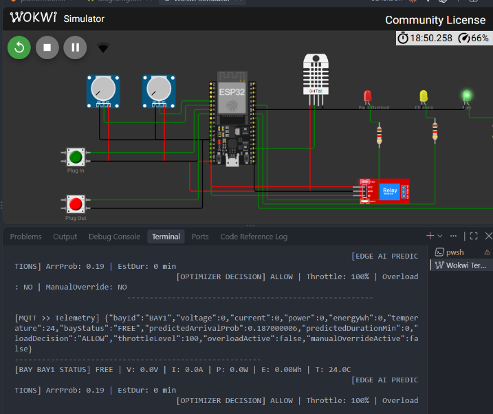
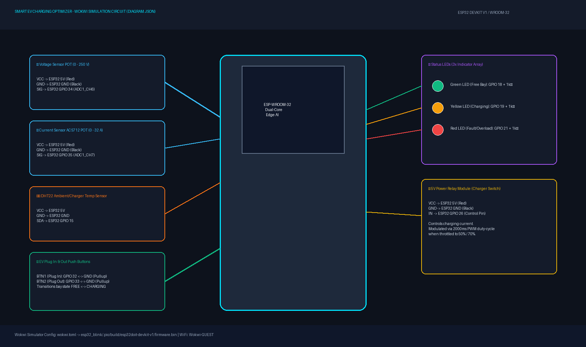
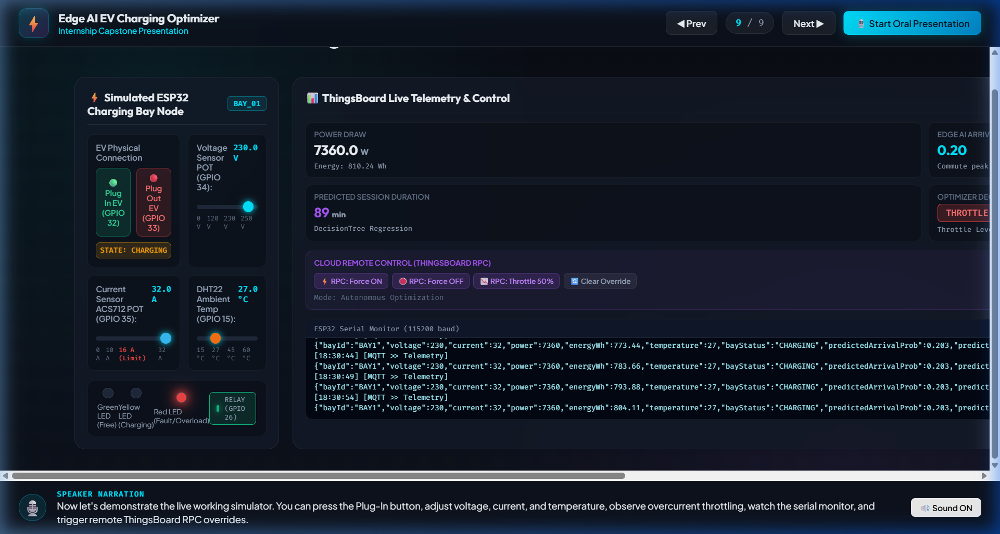
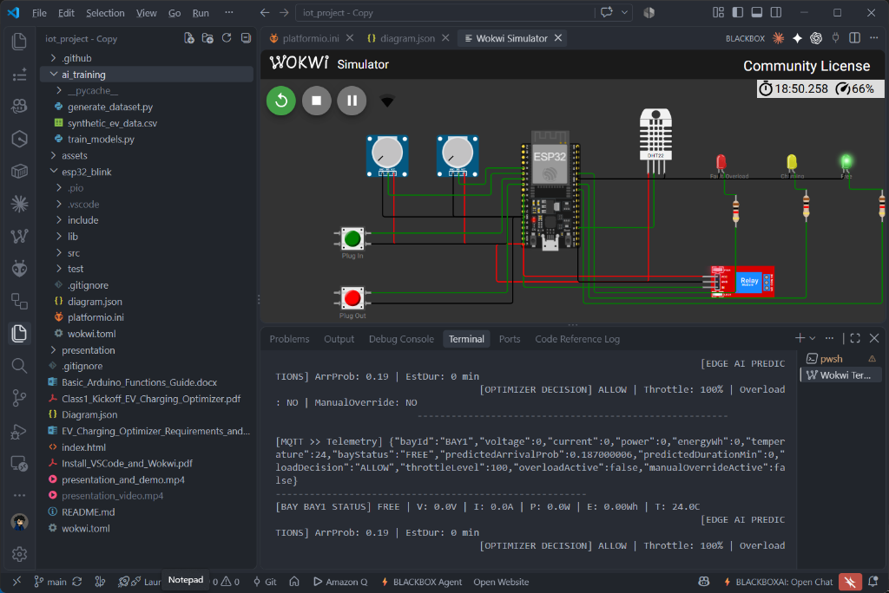

# Smart EV Charging Station Optimizer (Edge AI + IoT)

An intelligent, multi-bay Electric Vehicle (EV) charging station optimizer powered by **ESP32**, **Embedded Edge AI inference**, **MQTT**, and **ThingsBoard**.

This system autonomously monitors charging bay electrical parameters, predicts short-term EV arrival demand and session duration on-device, optimizes charger allocation/throttling to prevent power grid overloads and reduce peak-tariff costs, and connects seamlessly to ThingsBoard for real-time monitoring, telemetry logging, alarms, and remote RPC control.

---

## 📸 Working Model Simulation & Hardware Structure (`Diagram.json`)

### 1. Live Running Wokwi Simulator & Serial Telemetry Stream
The simulated ESP32 charging node running inside Wokwi with dual ADC potentiometers, DHT22 sensor, pushbuttons, status LEDs, power relay, and live serial telemetry:



### 2. Hardware Circuit Schematic & Wiring Pinout
Detailed connection map between ESP32 DevKit and all peripherals:



### 3. Real-Time ThingsBoard Cloud Dashboard & Simulator
Live telemetry gauges, Edge AI arrival predictions, remaining duration regression, and ThingsBoard RPC controls:



### 4. VS Code PlatformIO Development Environment
Modular C++ codebase with PlatformIO build toolchain and live Wokwi terminal:



---

## 🎬 Oral Presentation & Video Walkthrough

- 🌐 **Live Interactive Presentation & Simulator App:** [https://kaushal-saini.github.io/smart-edge-ai-based-ev-charging-optimizer/](https://kaushal-saini.github.io/smart-edge-ai-based-ev-charging-optimizer/)
- 📹 **Recorded MP4 Video File:** Available in the repository as [`presentation_video.mp4`](./presentation_video.mp4) (ready to upload/view on YouTube).

---

## 🏗️ System Architecture

The project follows a 3-layer Edge–Communication–Cloud architecture:

```
+-------------------------------------------------------------------------+
|                              EDGE LAYER (ESP32)                        |
|                                                                         |
|  +---------------------+   +---------------------+   +---------------+  |
|  | Sensors & Inputs    |-->| Edge AI Inference   |-->| Optimization  |  |
|  | - Voltage (GPIO34)  |   | - Logistic Reg (Arr)|   | - ALLOW       |  |
|  | - Current (GPIO35)  |   | - DecisionTree (Dur)|   | - THROTTLE    |  |
|  | - DHT22 (GPIO15)    |   | (Embedded model.h)  |   | - DEFER       |  |
|  | - Plug In/Out Btns  |   +---------------------+   +-------+-------+  |
|  +---------------------+                                     |          |
|                                                              v          |
|  +---------------------+   +---------------------+   +---------------+  |
|  | Actuation / Display |<--| State Manager       |   | Relay PWM &   |  |
|  | - Status LEDs       |   | - Energy Accumulator|   | Duty-Cycle    |  |
|  |   (G:18, Y:19, R:21)|   | - Session Timing    |   | (GPIO26)      |  |
|  +---------------------+   +----------+----------+   +---------------+  |
+---------------------------------------|---------------------------------+
                                        | (MQTT JSON)
                                        v
+-------------------------------------------------------------------------+
|                           COMMUNICATION LAYER                           |
|  - WiFi (Wokwi-GUEST / local WiFi)                                      |
|  - MQTT Broker (ThingsBoard: 1883)                                      |
|  - Telemetry: v1/devices/me/telemetry                                   |
|  - Shared Attributes: v1/devices/me/attributes                          |
|  - RPC Commands: v1/devices/me/rpc/request/+                            |
+-------------------------------------------------------------------------+
                                        |
                                        v
+-------------------------------------------------------------------------+
|                            CLOUD LAYER (ThingsBoard)                    |
|  - Real-time Dashboards (Gauges, Charts, Status Cards)                  |
|  - Remote Control RPC (setRelayState, setThrottle, getStatus)           |
|  - Shared Attributes Configuration (maxStationLoadW, overloadCurrentA)  |
|  - Rule Chains for Alarms (Overload, Offline, High Demand)              |
+-------------------------------------------------------------------------+
```

---

## 🔌 Hardware / Pin Configuration (Wokwi Simulation)

| Pin / Component | GPIO | Description / Simulation Mapping |
| :--- | :--- | :--- |
| **Voltage Sensor** | `GPIO34` | Potentiometer calibrated to 0 – 250 V |
| **Current Sensor** | `GPIO35` | Potentiometer (ACS712) calibrated to 0 – 32.0 A |
| **Temperature Sensor** | `GPIO15` | DHT22 (Digital Ambient/Charger Temperature) |
| **Plug-In Button** | `GPIO32` | Push Button (`INPUT_PULLUP`) — transitions bay to `CHARGING` |
| **Plug-Out Button** | `GPIO33` | Push Button (`INPUT_PULLUP`) — transitions bay to `FREE` |
| **Green LED** | `GPIO18` | Status: `FREE` (Available) |
| **Yellow LED** | `GPIO19` | Status: `CHARGING` (Active) |
| **Red LED** | `GPIO21` | Status: `FAULT / OVERLOAD` |
| **Charger Relay** | `GPIO26` | Switches charging power (modulated via duty cycle when throttled) |

---

## 🧠 Edge AI Prediction Models

Embedded directly into the ESP32 firmware via `include/model.h`:
1. **Short-Term Arrival Probability (`predictArrival`)**:
   - Logistic regression model trained on commute hours, bay occupancy, recent current trend, and session elapsed time.
   - Outputs probability ($0.0 \to 1.0$) of a new EV arrival in the next window.
2. **Remaining Session Duration (`predictDuration`)**:
   - Decision Tree Regressor predicting remaining charging time in minutes for active sessions.

To re-train or generate new synthetic datasets:
```bash
python ai_training/train_models.py
```

---

## ⚡ Local Optimization Algorithm

Every 5 seconds, the ESP32 evaluates:
- **Overcurrent Protection**: If `current > overloadCurrentA` (default 16A), sets `loadDecision = "THROTTLE"`, throttles relay to 50%, and illuminates the Red Fault LED.
- **Power Cap Management**: If station power exceeds `maxStationLoadW` (default 6000W), throttles sessions with longer remaining duration to 70% while allowing nearly completed sessions to finish at 100%.
- **Peak-Tariff Deferral**: During peak electricity tariff hours (`peakTariffStartHr` to `peakTariffEndHr`), idle bays defer non-critical charging if arrival probability is below `predictionThreshold`.
- **Normal Operation**: Sets `loadDecision = "ALLOW"` and 100% full power.

---

## 📡 MQTT Payload & Communication Specs

### 1. Telemetry (`v1/devices/me/telemetry`)
Published every 5 seconds:
```json
{
  "bayId": "BAY1",
  "voltage": 230.2,
  "current": 14.5,
  "power": 3337.9,
  "energyWh": 145.20,
  "temperature": 26.4,
  "bayStatus": "CHARGING",
  "predictedArrivalProb": 0.62,
  "predictedDurationMin": 45,
  "loadDecision": "ALLOW",
  "throttleLevel": 100,
  "overloadActive": false,
  "manualOverrideActive": false
}
```

### 2. Shared Attributes (`v1/devices/me/attributes`)
Dynamic cloud configuration without reflashing:
- `maxStationLoadW`: Station power limit (e.g. `6000.0`)
- `overloadCurrentA`: Safety current threshold (e.g. `16.0`)
- `peakTariffStartHr` / `peakTariffEndHr`: Peak hours (e.g. `18` to `22`)
- `predictionThreshold`: Standby probability threshold (e.g. `0.5`)

### 3. Remote RPC Commands (`v1/devices/me/rpc/request/+`)
- `setRelayState`: `{"state": true}` or `{"state": false}`
- `setThrottle`: `{"level": 0-100}`
- `clearOverride`: `{"clear": true}`
- `getStatus`: Returns real-time status snapshot

---

## 🚀 How to Build & Run

### 1. Build Firmware with PlatformIO
```bash
# In project folder:
pio run -d esp32_blink
```

### 2. Run Wokwi Simulation
- In VS Code with the **Wokwi Simulator** extension installed:
  1. Open `Diagram.json` or press `F1` -> `Wokwi: Start Simulator`.
  2. The simulation boots the compiled binary, connects to simulated WiFi (`Wokwi-GUEST`), and begins streaming to ThingsBoard.

### 3. Configure ThingsBoard
1. Create a device in ThingsBoard (e.g. `BAY1`).
2. Copy the **Device Access Token** into `esp32_blink/src/config.cpp` (`TB_TOKEN`).
3. Build and run the simulation.

---

## 📁 Repository Structure

```
smart-edge-ai-based-ev-charging-optimizer/
├── Diagram.json               # Wokwi simulation circuit layout
├── wokwi.toml                 # Wokwi simulation configuration
├── README.md                  # Project documentation & screenshots
├── index.html                 # Root redirect for GitHub Pages deployment
├── assets/                    # Circuit schematics and simulator screenshots
│   ├── wokwi_simulation_running.png
│   ├── circuit_layout.png
│   ├── live_simulator_dashboard.png
│   └── wokwi_vscode_full_ide.png
├── presentation/              # Interactive Presentation Slide Deck Web App
│   ├── index.html
│   ├── style.css
│   └── app.js
├── ai_training/               # Edge AI offline training pipeline
│   ├── generate_dataset.py    # Synthetic dataset generator
│   ├── train_models.py        # Scikit-learn model trainer & C exporter
│   └── synthetic_ev_data.csv  # Generated training dataset
└── esp32_blink/               # Main PlatformIO firmware project
    ├── platformio.ini         # PlatformIO dependencies & board config
    ├── include/
    │   ├── config.h           # Pinouts, WiFi & ThingsBoard credentials
    │   ├── state.h            # Global telemetry and bay states
    │   ├── sensors.h          # ADC reading, DHT22 & button handling
    │   ├── model.h            # Embedded C AI models
    │   ├── edge_ai.h          # Time sync & inference pipeline
    │   ├── optimization.h     # Allocation & throttling rules
    │   ├── network.h          # WiFi & MQTT manager
    │   ├── telemetry.h        # MQTT telemetry serialization
    │   ├── attributes.h       # Shared attributes handler
    │   └── rpc.h              # RPC command processor
    └── src/
        ├── config.cpp
        ├── state.cpp
        ├── sensors.cpp
        ├── edge_ai.cpp
        ├── optimization.cpp
        ├── network.cpp
        ├── telemetry.cpp
        ├── attributes.cpp
        ├── rpc.cpp
        └── main.cpp           # Master setup & loop orchestration
```
